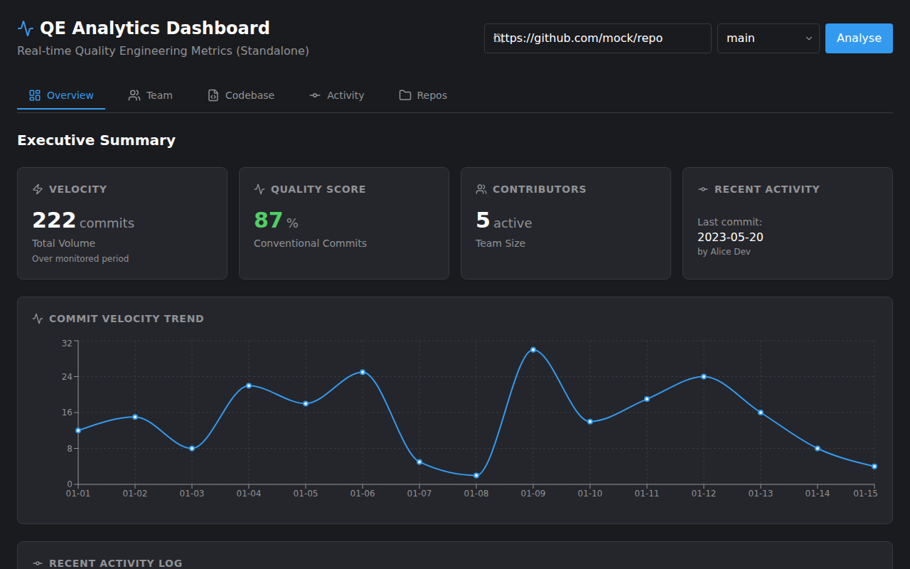
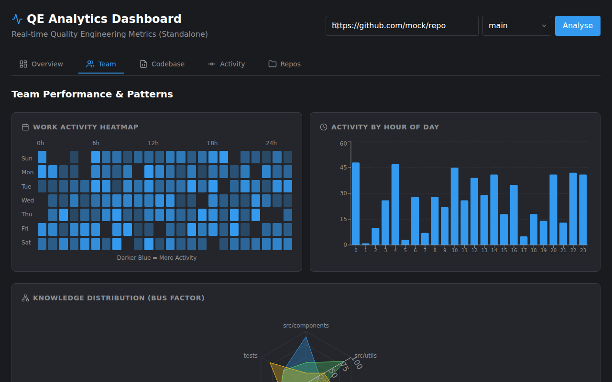
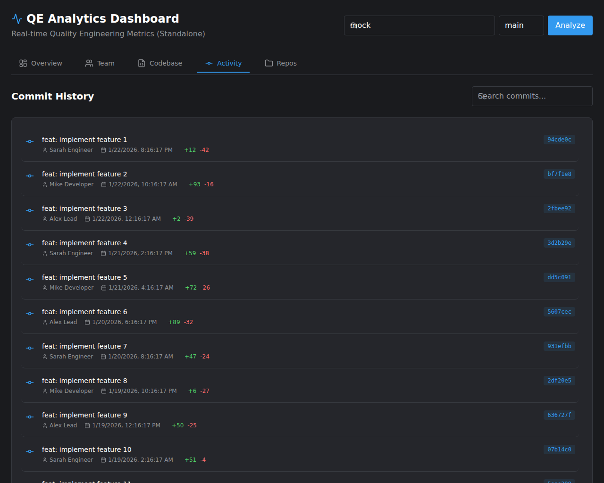

# QE Analytics Dashboard

A modern, cross-platform analytics dashboard for visualizing Quality Engineering metrics from Git repositories.



## 🚀 Overview

Gain real-time insights into your team's development velocity, code quality, and churn. The QE Analytics Dashboard parses Git history to provide actionable metrics, helping engineering teams improve their processes.

## ✨ Key Features

### 📊 Executive Overview
Get a high-level view of your project's health with key metrics at a glance.
*   **Velocity**: Visualizes commit volume trends to track team cadence.
*   **Quality Score**: Monitors adherence to Conventional Commits standards.
*   **Summary Metrics**: Instant visibility into churn, team size, and recent activity.

### 👥 Team Performance
Understand how your team works and collaborate better.
*   **Work Patterns**: Heatmaps and hourly breakdowns to understand peak activity times.
*   **Top Contributors**: Identify most active authors and their impact (commits, additions, deletions).
*   **Activity Trends**: Visualize individual contributions over time.



### 🩺 Codebase Health
Deep dive into the technical state of your repository.
*   **Hotspots**: Detect frequently modified files ("God Classes") that may need refactoring.
*   **Code Churn**: Analyze lines added vs. deleted to identify heavy refactoring or instability.
*   **Commit Types**: Breakdown of commit types (feat, fix, chore) to understand work distribution.


### 📜 Activity Log
Full visibility into the repository history.
*   **Searchable History**: Quickly find commits by message, author, or hash.
*   **Detailed Diff Stats**: See additions and deletions per commit.



### 🌍 Cross-Platform Support
Use the dashboard where it suits you best:
*   **Web**: Run as a self-hosted web application or Docker container.
*   **Desktop**: Native application for Windows, macOS, and Linux (Electron).
*   **Mobile**: Optimized PWA and native Android support for insights on the go.

### 📂 Repository Management
Easily manage and switch between multiple local repositories directly from the UI.


## 🏁 Getting Started

### Quick Start (Docker)
The easiest way to run the dashboard is using Docker:

```bash
docker-compose up --build
```

Then visit `http://localhost:8080`.

### For Developers
If you want to contribute, build from source, or run the application locally without Docker, please check our [Developer Guide](DEVELOPER.md).

## 🔧 Troubleshooting

### macOS: "App is damaged and can't be opened"
If you encounter this error on macOS (especially on M1/M2/M3 chips), it is likely due to the application being self-signed or unsigned. To fix this:

1.  Open Terminal.
2.  Run the following command to remove the quarantine attribute:
    ```bash
    xattr -cr /Applications/Git\ Analytics.app
    ```
    *(Adjust the path if you installed it elsewhere)*
3.  Launch the application again.

## 📄 License
ISC
