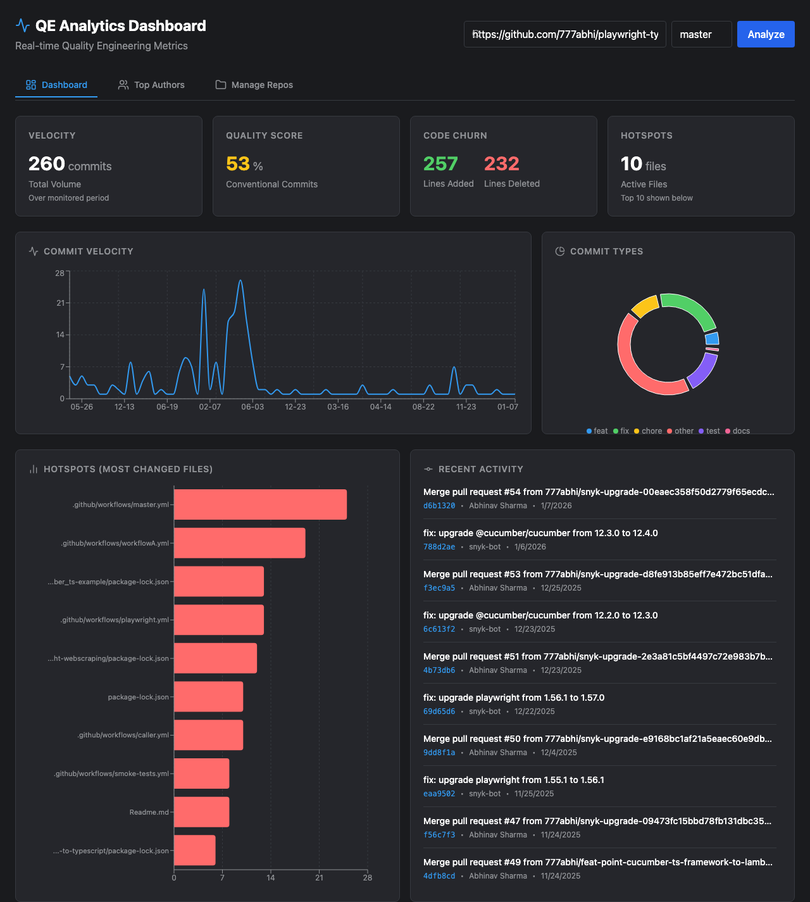
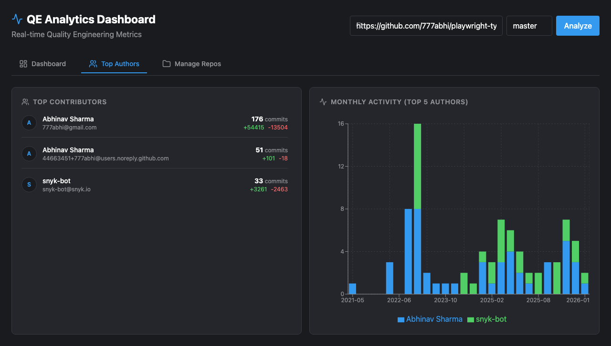
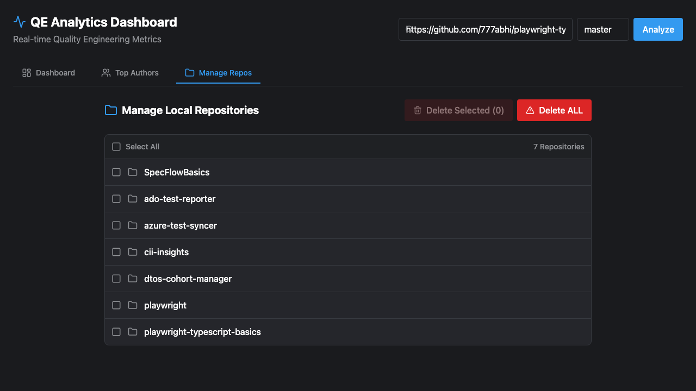

# QE Analytics Dashboard

A modern, cross-platform analytics dashboard for visualizing Quality Engineering metrics from Git repositories.



## 🚀 Overview

Gain real-time insights into your team's development velocity, code quality, and churn. The QE Analytics Dashboard parses Git history to provide actionable metrics, helping engineering teams improve their processes.

## ✨ Key Features

### 📊 Comprehensive Metrics
*   **Velocity**: Visualizes commit volume to track team cadence.
*   **Quality Score**: Monitors adherence to Conventional Commits standards.
*   **Code Churn**: Highlights lines added vs. deleted to identify refactoring efforts.
*   **Hotspots**: Detects frequently modified files ("God Classes") that may need refactoring.

### 👥 Team Insights
*   **Top Contributors**: Identifies most active authors.
*   **Activity Trends**: Visualizes individual contributions over time.



### 🌍 Cross-Platform Support
Use the dashboard where it suits you best:
*   **Web**: Run as a self-hosted web application or Docker container.
*   **Desktop**: Native application for Windows, macOS, and Linux (Electron).
*   **Mobile**: Optimized PWA and native Android support for insights on the go.

### 📂 Repository Management
Easily manage and switch between multiple local repositories directly from the UI.



## 🏁 Getting Started

### Quick Start (Docker)
The easiest way to run the dashboard is using Docker:

```bash
docker-compose up --build
```

Then visit `http://localhost:8080`.

### For Developers
If you want to contribute, build from source, or run the application locally without Docker, please check our [Developer Guide](DEVELOPER.md).

## 📄 License
ISC
