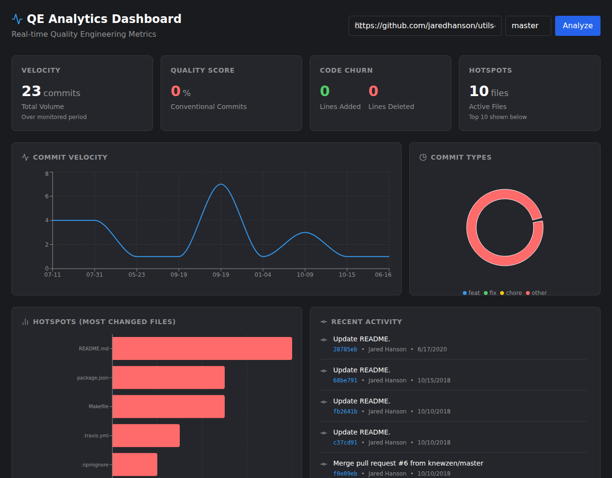

# QE Analytics Dashboard

A lightweight, interactive, modern analytics dashboard designed to synthesize and visualize Quality Engineering (QE) metrics from Git repositories.



## Overview

This application allows engineering teams to gain real-time insights into their development patterns, velocity, and code quality by analyzing Git history. Simply provide a repository URL and branch, and the dashboard will visualize key performance indicators.

## Metrics & Engineering Insights

The dashboard provides the following metrics to answer critical engineering questions:

### 1. Velocity (Commit Activity)
*   **Metric:** Volume of commits over time (Daily/Weekly).
*   **Description:** Tracks the frequency of changes to the codebase.
*   **Engineering Insight:**
    *   *How fast is the team moving?*
    *   *Are there bottlenecks or periods of inactivity?*
    *   *Is the delivery cadence consistent?*

### 2. Quality Score (Conventional Commits)
*   **Metric:** Percentage of commit messages following the [Conventional Commits](https://www.conventionalcommits.org/) standard.
*   **Description:** Analyzes commit subjects for prefixes like `feat:`, `fix:`, `chore:`, etc.
*   **Engineering Insight:**
    *   *How disciplined is the team in documenting changes?*
    *   *Are we maintaining a clean and parseable history for automated release notes?*

### 3. Code Churn
*   **Metric:** Ratio of Lines Added vs. Lines Deleted (rolling 30-day window).
*   **Description:** Measures the magnitude of code flux.
*   **Engineering Insight:**
    *   *Is the code stabilizing or becoming more volatile?*
    *   *High deletion rates might indicate refactoring, while high addition rates suggest feature growth.*

### 4. Hotspots
*   **Metric:** Files modified most frequently.
*   **Description:** Identifies modules or files that are touched in many commits.
*   **Engineering Insight:**
    *   *Where is the technical debt?*
    *   *Which files are "god classes" or potential single points of failure?*
    *   *Which areas of the code carry the highest risk of regression?*

### 5. Commit Type Breakdown
*   **Metric:** Distribution of work types (Features, Fixes, Chores, etc.).
*   **Engineering Insight:**
    *   *Where are we spending our effort? (New features vs. bug fixing)*
    *   *Is the maintenance burden (chores/fixes) outweighing value delivery (features)?*

## getting Started

### Prerequisites
*   Node.js (v18+)
*   Git

### Installation

1.  Clone the repository.
2.  Install dependencies:
    ```bash
    # Backend
    cd server
    npm install

    # Frontend
    cd ../client
    npm install
    ```

### Running the App

1.  Start the backend server (runs on port 3001):
    ```bash
    cd server
    node index.js
    ```
2.  Start the frontend (runs on port 5173):
    ```bash
    cd client
    npm run dev
    ```
3.  Open `http://localhost:5173` in your browser.
